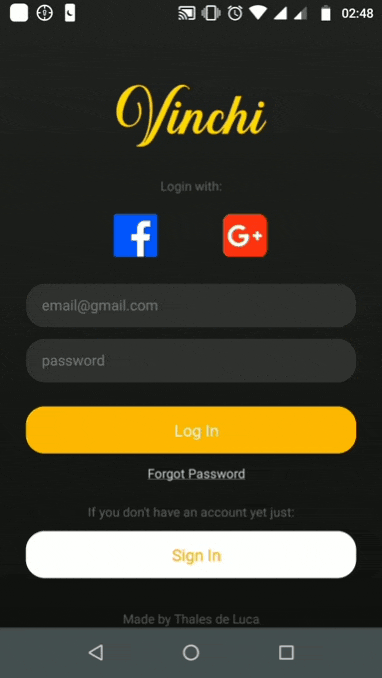

#
An app made in order to learn React Native.
# Demos
<table>
   <tr>
     <td align="center">
        
      </td>
      <td align="center">
        
      </td>
      <td align="center">
        
      </td>
   </tr>
   <tr>
     <td align="center">
        Welcome screen and sign up 
      </td>
      <td align="center">
        Nearby Feed (other options not implemented yet)
      </td>
      <td align="center">
        Post Creation
      </td>
   </tr>
</table>


## Documentation


## Latest Releases
Android: [v1.0 Download](https://raw.githubusercontent.com/thalesdeluca/Vinchi/master/releases/vinchi.apk)
iOS: Not built yet

Other releases can be found at ``/releases/`` folder.

## About
This project was originally created for a university work, more specifically, a Software Requirements work. The idea was to create an app that focus on self-promoting microbusiness, restaurants and local markets, being a option for those who publish their products on facebook groups etc...

## Installation
First of all, you need to clone the repository and run ``npm i`` to install dependencies.

```
$ git clone https://github.com/thalesdeluca/Vinchi.git
$ cd Vinchi
$ npm i
```

<br/>
<br/>

After this, you'll have to create a file on the project's root `` ~/Vinchi/ `` named `` api-key.js `` which it'll have to contain both firebase and google config:

```
export const config = {
   //Here goes your firebase config
   //apiKey, authDomain...
};

export const googleConfig = {
   //Here goes your google Auth config
   //webClient, offlineAccess...
}
```
<br/>
<br/>

Now you'll have to create and ``strings.xml`` file on path ``~/Vinchi/android/app/src/res/values/`` with the following:

```
<?xml version="1.0" encoding="utf-8"?>
<resources>
  <string name="app_name">Vinchi</string>
  <string name="facebook_app_id">//Here goes your facebook </string>
</resources>
```

<br/>
<br/>

On ``~/Vinchi/android/app/`` you'll have to place your ``google-services.json`` ( the one you get at firebase android setup).

<br/>

On project's root ``~/Vinchi/`` place your ``credentials.json`` that you get at google auth developers.

<br/>

And voilá, you're set!


##


